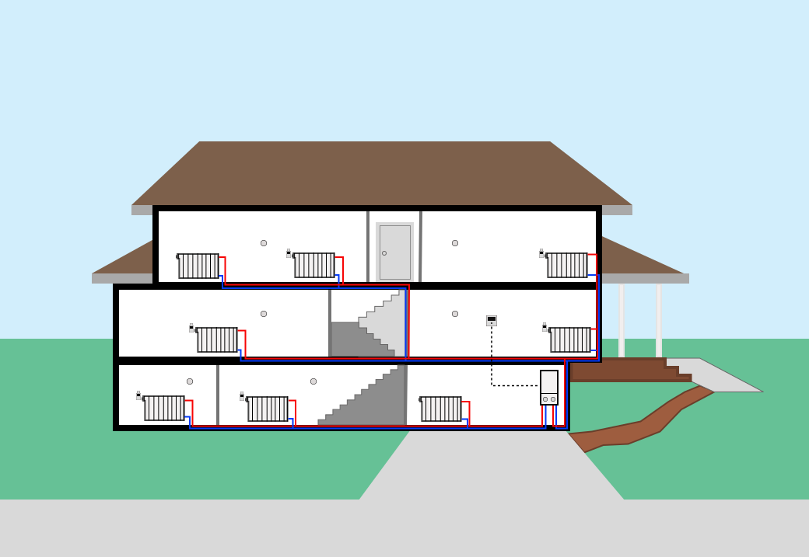

# Home Assistant Automated TRV Zone Heating

Welcome 👋

Here you'll find a collection of automations that'll allow you to _precisely_ control the heating within your home on a room-by-room basis, using [Zigbee](https://en.wikipedia.org/wiki/Zigbee) based TRVs and temperature sensors.

## Why Use This
> Fine-tunable, fully automated, and remote-controlled heating. 

This is a cost efficient system which converts traditional hot water radiator heating systems into a zone-controlled heating system; each room with an installation has the capability to self-regulate its own temperature.

This project's goal is to be as comprehensive as possible, providing a local-controlled alternative to closed source automated heating systems like that offered by [Tado](https://www.tado.com/nl-nl?srsltid=AfmBOorJe498UwW5kq8HAElu1WR35V_Gj9q3CalYz6Kc3KUPyQKnGuGW), [Drayton's Wiser](https://www.draytoncontrols.co.uk/products/smart-heating/wiser), and [Resieo's Evohome](https://www.resideo.com/nl/nl/oplossingen/comfort/evohome/).

### What's a TRV (Thermostatic Radiator Valve)
> [Wikipedia](https://en.wikipedia.org/wiki/Thermostatic_radiator_valve)

A TRV (Thermostatic Radiator Valve) is a device which is connected to hot water radiator heating systems, at each radiator. These allow you to set a rough temperature per room by adjusting the water in-flow into each radiator. These offer better temperature regulation than conventional flow based radiator valves, but still require the the main heating system to be pumping in order to heat the room or area.

## How This Works
> **@todo**

## Getting Started
### Purchasing Equipment

    <a href="./documentation/bill-of-materials.md">
        👉 Checkout the Bill of Materials (BOM) to see my recommendations 👈
    </a> 

### Design Considerations and Safety Precautions
> [!WARNING]
> It's very important that every aspect of this system can be manually controlled, both _digitally and physically!_
>
> You must consider fall-back options, should your Home Assistant installation or internet connectivity fail. Provided you followed the steps outlined here, your system _should be failsafe_.

A personal anecdote. I've used this setup for over a year and experienced both a power failure, and my Home Assistant system failing to boot. Neither events affected our heating, as each radiator is locally controlled, and our thermostat (Google Learning Thermostat) is still capable of local independent control our boiler. We still had heating when we needed it, even when the automation failed.

### Prerequisites
> [!IMPORTANT]
> You must have a decent level of familiarity with [Home Assistant](https://www.home-assistant.io/); the open source home automation platform.

1. A central, hot water based, heating system that uses radiators and a "CV boiler"
    - For best results, your CV needs to be **OpenTherm compatible**. This standard is nearly 30 years old, so it's likely yours is, but there are some caveats:
        - Some Nefit / Bosch units may require an additional addon to convert their CVs from Bosch's proprietary communication standard. The (Nefit) Bosh part number is `7746901847`.
        - [You can reference known OpenTherm compatible systems here](https://www.opentherm.eu/products/)
1. An established and functional Home Assistant installation
1. [A Home Assistant installation with HACS](https://www.hacs.xyz/docs/use/download/download/); we'll need a few integrations which fall outside the realm of "official integrations."
1. A Zigbee coordinator
1. An established and configured [Zigbee2MQTT installation within Home Assistant](https://github.com/zigbee2mqtt/hassio-zigbee2mqtt?tab=readme-ov-file#installation)

## Installation
### Planning our Installation
Let's assume we're installing this system in a fictional house:

  
   
  

    Our base house without valves or automation
  

This house has:
- 3 levels
- 1 CV boiler
- 8 radiators
- 1 central thermostat
- 2 heating loops

#### Step 1
We need to decide which radiators will be equipped with TRVs and which radiators will remain as "dumb radiators." We must have at least one "dumb radiator" per heating loop to prevent damage to your CV.

> [!IMPORTANT]
> It is critical to have a few "dumb radiators" throughout your house, with them set to be marginally open. This is generally called "Frost Protection" on consumer systems. Failure to have a couple non-automated radiators on your system could create a water hammer-like effect within your heating loops, which could cause damage to your CV. 
> 
> For example, a potential runaway scenario would be when all TRVs are closed on your system (the rooms are at the desired temperature), while the Central Thermostat is still calling for heat. Since you've got a few "dumb radiators" on each heating loop, that means that _those_ radiators are still open on the system, reducing the total system pressure, and mitigating any over-pressure events.

Once you've decided on which rooms will have TRVs, you then need to assess whether or not that room has one or more-than-one radiator. If it has one radiator, then install a TRV. If it has more-than-one radiator, you must install a TRV on _only one_ of the radiators - the others must remain dumb. This is because each room will be classified as a "climate."

#### Step 2
Now that you've planned out which rooms and which radiators will have TRVs, you can go ahead and install all TRVs and temperature sensors.

  
   
  

    Our house with TRVs and temperature sensors
  

  <table>
    <tr>
        <th>Device Image</th>
        <th>Device Name</th>
    </tr>
    <tr align="center">
        <td>
            
        </td>
        <td>Central Thermostat</td>
    </tr>
    <tr align="center">
        <td>
            
        </td>
        <td>TRV</td>
    </tr>
    <tr align="center">
        <td>
            
        </td>
        <td>Temperature Sensor</td>
    </tr>
  </table>

#### Step 4
Add all devices to Home Assistant via Zigbee2MQTT. Make sure you use a consistent and clear naming scheme. I use the following:

- `[ Climate Area ] - [ Sensor / Device Type ] - [ Numerical Room Identifier{.}Numerical Device Identifier ] - [ Unique Identifier ]`
    - Climate area 
        - the room that the device is installed in
    - Sensor / Device Type 
        - the type of sensor. TRV, temperature sensor, presence sensor, etc
    - Numerical Room Identifier
        - Each room should be numbered, so all devices within that room can be indexed. For example:
            - Kitchen = 1
            - Living Room = 2
            - Main Bedroom = 3
            - Guest Bedroom = 4
            - Etc
    - Unique Identifier
        > 💡 make sure each device has its unique identifier attached to itself!
        - Each sensor should have a unique identifier. My rule of thumb is to prefix all devices of _a type_ with a common letter, followed by a number. That way you can move sensors around the house and rename them easily. For example:
            - All TRVs are labeled as `TRVX` where `X` is a number
                - `TRV1` is in the Bathroom
                - `TRV2` is in the Kitchen
            - All temperature sensors are prefixed with the letter `K`
                - `K1` is in the Main Bedroom
                - `K2` is in the Bathroom
                - `K3` is in the Kitchen

This translates to:
- `Kitchen - TRV - 2.1 - TRV3`
- `Kitchen - Temperature - 2.2 - K3`
- `Bathroom - TRV - 4.1 - TRV2`
- `Bathroom - Temperature - 4.2 - K2`

Using a predictable naming scheme will allow you to filter or search for devices by type, location, or unique identifier.

#### Step 5
The hard work is done and now it's time to start creating climates in Home Assistant! Make a beverage of your choice and sit yourself down in-front of your computer.

- Make sure the [Weather integration is configured](https://www.home-assistant.io/integrations/weather/) in your Home Assistant installation
- [Install "Better Thermostat"](https://better-thermostat.org/configuration) via HACS; trust me, you'll want this.

> **@todo**
